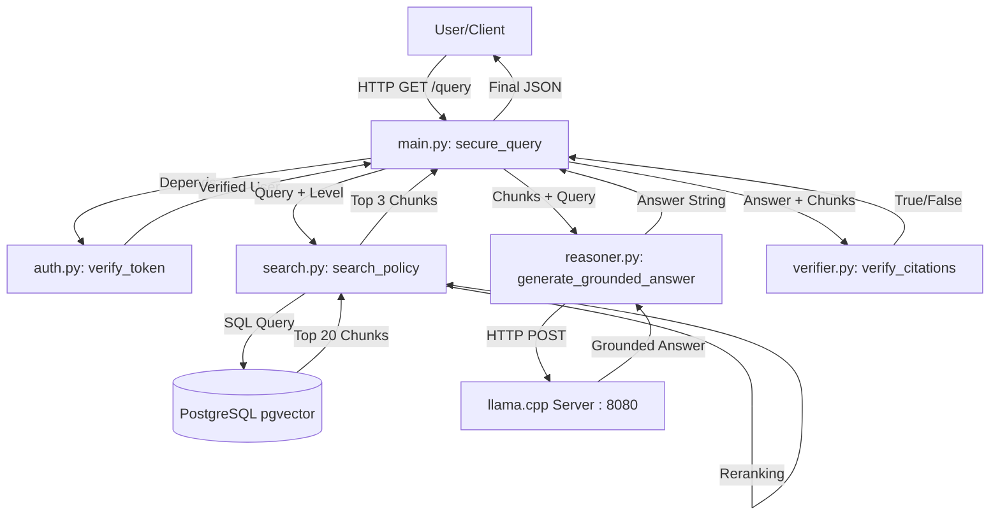

# Detailed Explanation: main.py & The Orchestration Flow

`main.py` is the central nervous system of the Codex project. It manages the request lifecycle, enforces security, and orchestrates the interaction between the retrieval engine, the reasoning agent, and the verification guardrail.

## 1. The Imports: Dependency Map

The API relies on several specialized modules to perform its tasks:

- **FastAPI Core:** `FastAPI`, `Depends`, `HTTPException`, `status`.
  - `FastAPI`: The framework used to build the web server.
  - `Depends`: Used for "Dependency Injection," allowing the app to run authentication checks before reaching the main logic.
- **Security:** `OAuth2PasswordBearer`, `OAuth2PasswordRequestForm`.
  - These provide the standard OAuth2 flow, enabling the "Authorize" button in the Swagger UI.
- **Internal Packages:**
  - `auth.py`: Handles the creation and verification of JWT tokens.
  - `schemas.py`: Ensures that the data sent and received (like the `Token` model) is valid.
- **The Intelligence Pipeline:**
  - `search_policy`: The retrieval engine (pgvector + reranker).
  - `generate_grounded_answer`: The LLM brain (llama.cpp).
  - `verify_citations`: The hallucination judge.

---

## 2. Core Components

### The Mock User Database (`MOCK_USERS`)
For the MVP, users are stored in a dictionary. Each user is assigned an `access_level`:
- **Level 3 (Admin):** Full access.
- **Level 2 (Manager):** Moderate access.
- **Level 1 (Employee):** Basic access.

### The Auth Guard (`get_current_user`)
This function is a "dependency." Whenever a route is marked with `Depends(get_current_user)`, FastAPI does the following:
1. Extracts the `Bearer <token>` from the request header.
2. Calls `verify_token()` from `auth.py`.
3. If the token is invalid or expired $\rightarrow$ Raises a **401 Unauthorized** error.
4. If valid $\rightarrow$ Returns the user's identity (username and access level).

---

## 3. The Endpoints

### A. The Login Flow (`/login`)
**Goal:** Convert credentials into a secure, time-limited passport (JWT).
1. Receives `username` and `password`.
2. Checks if they match a record in `MOCK_USERS`.
3. Calls `create_access_token()` to sign a JWT containing the user's `access_level`.
4. Returns a JSON object: `{"access_token": "...", "token_type": "bearer"}`.

### B. The Query Flow (`/query`)
**Goal:** provide a grounded, verified answer to a policy question.

**The Step-by-Step Pipeline:**
1. **User Identity:** Extracts the `access_level` from the verified user object.
2. **Step 1: Retrieval (`search_policy`)**:
   - Sends the query and access level to the search engine.
   - The engine returns only the chunks the user is allowed to see.
3. **Step 2: Reasoning (`generate_grounded_answer`)**:
   - Sends the retrieved chunks to the DeepSeek-R1 model via the `llama.cpp` server.
   - The model produces an answer strictly grounded in the provided text.
4. **Step 3: Verification (`verify_citations`)**:
   - The verifier scans the answer for citations like `[Doc: ..., Clause: ...]`.
   - It checks if these citations actually exist in the retrieved chunks.
5. **Step 4: Final Verdict**:
   - **Valid + Answer found** $\rightarrow$ Verdict: `clear`.
   - **Valid + No answer found** $\rightarrow$ Verdict: `abstained` (Insufficient basis).
   - **Invalid (Hallucination)** $\rightarrow$ Verdict: `abstained` (Answer rejected by guardrails).

---

## 4. The Complete Call Chain

---

## 5. Summary of Logic Flow

| Request Stage | File Responsible | Key Variable/Function | Result |
|:---|:---|:---|:---|
| **Authentication** | `auth.py` | `verify_token()` | User Identity & Access Level |
| **Retrieval** | `search.py` | `search_policy()` | Top 3 relevant, authorized chunks |
| **Synthesis** | `reasoner.py` | `generate_grounded_answer()` | Grounded answer with citations |
| **Audit** | `verifier.py` | `verify_citations()` | Boolean check for hallucinations |
| **Response** | `main.py` | `secure_query()` | Verified JSON Answer Payload |
